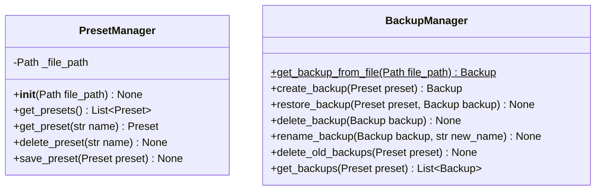
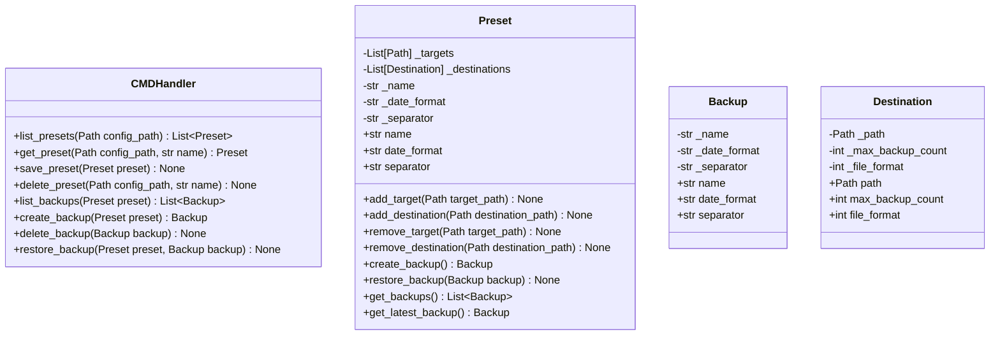
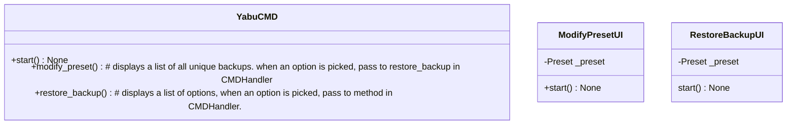
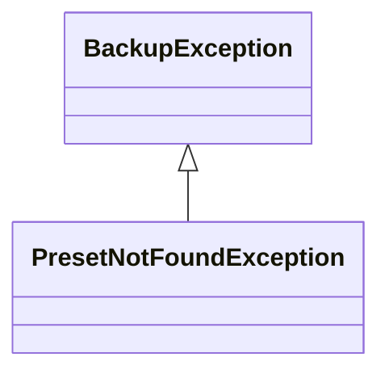

# YABU

YABU stands for "Yet Another Backup Utility"

## Usage
`yabu backup [-f|-k] <preset>` - create a backup using the `preset`. if the `f` flag is set, force the backup creation even if it was already saved. if the `k` flag is set, keep backups beyond the max_backup_count.
`yabu restore <preset>` - restore a backup from the `preset`
`yabu modify <preset>` - modify the `preset`. if the preset does not exist, create a blank one.

YABU loads a file in your HOME directory called `.yabu_config.json`, it should have the following structure:
```json
{
	"minecraft": {
		"targets": [
			"C:\\Users\\InValidFire\\AppData\\Roaming\\.minecraft\\saves\\main_world",
			"C:\\Users\\InValidFire\\AppData\\Roaming\\.minecraft\\saves\\building_world"
		],
		"destinations": [
			{
				"path": "C:\\Users\\InValidFire\\.storage\\backups",
				"max_backup_count": 3,
				"file_format": "zip"
			},
			{
				"path": "D:\\backups",
				"max_backup_count": 10,
				"file_format": "zip"
			}
		]
	}
}
```
This can be validated with the following JSON Schema:
```json
{
    "$schema": "http://json-schema.org/draft-06/schema#",
    "$ref": "#/definitions/Root",
    "definitions": {
        "Root": {
            "type": "object",
            "additionalProperties": false,
            "patternProperties": {
                "^[a-zA-Z0-9_]+$": {
                    "$ref": "#/definitions/Preset"
                }
            },
            "minProperties": 1,
            "title": "Welcome4"
        },
        "Preset": {
            "type": "object",
            "additionalProperties": false,
            "properties": {
                "targets": {
                    "type": "array",
                    "items": {
                        "type": "string"
                    },
                    "minItems": 1
                },
                "destinations": {
                    "type": "array",
                    "items": {
                        "$ref": "#/definitions/Destination"
                    }
                }
            },
            "required": [
                "destinations",
                "targets"
            ],
            "title": "Minecraft"
        },
        "Destination": {
            "type": "object",
            "additionalProperties": false,
            "properties": {
                "path": {
                    "type": "string"
                },
                "max_backup_count": {
                    "type": "integer"
                },
                "file_format": {
                    "type": "string"
                }
            },
            "required": [
                "max_backup_count",
                "path",
                "file_format"
            ],
            "title": "Destination"
        }
    }
}
```
## Requirements

### System
0. create and manage backup presets and backups using a terminal UI.
1. allow for backups to be restored through the terminal UI.

### Backup Presets
0. backup creation and restoration is to be triggered through backup presets.
1. backup presets are to be saved in a human-readable format.
2. backup presets should have a unique name to serve as the preset identifier.
3. backup presets will store the paths of target directories & files, as well as the paths of destination directories.
	1. each backup target will have a backup created and stored in each destination, allowing for backups to multiple locations.
4. keep a backlog of past backups, the amount customizable to each destination.
5. backup presets will allow the user to select a supported file format for the backup, customizable to each destination.

### Backups
0. backups are to be stored in universal compressed formats, such as .zip, 7z, or .tar.
1. backup file names are to have the name of the file or folder, along with the backup creation date.
2. backups should know what their name, date format, and separator is, in the event the preset is changed.

### Restoring
0. user will be shown all unique backups found on the file system.
1. user can pick a backup to restore.
2. user can choose to delete a backup upon restoration.

## Models

// TODO: model out Config file validation & format versioning in the model package.

### Package: Model

### Package: Controller

### Package: View

### Package: Exceptions
